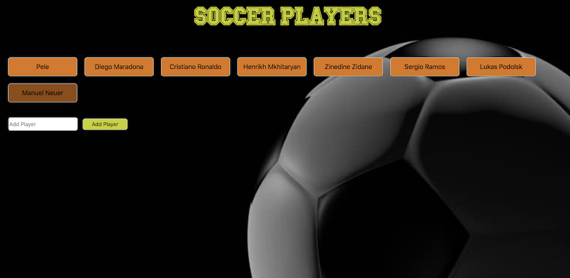
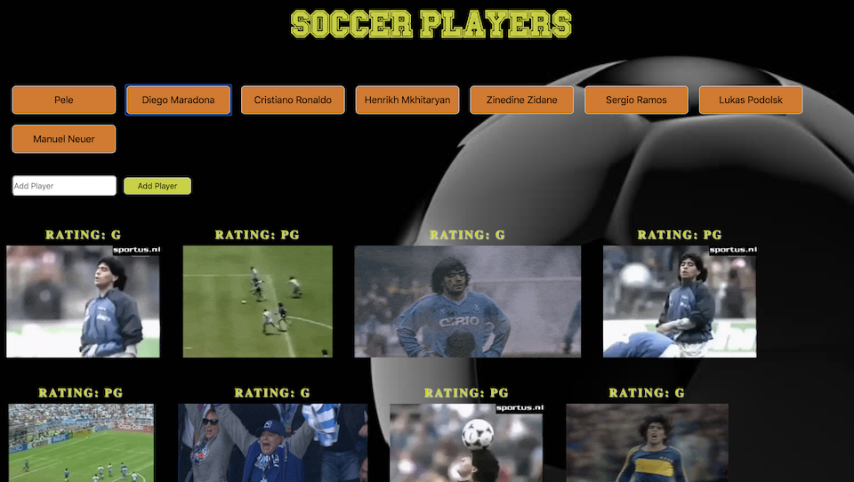

# GifTastic

## Soccer Player

** Link **

https://abareyan.github.io/GifTastic/

** Screen Shots **

** About the project **

The project was created by the GIPHY API.

The limit was 10 players.

** How to use this page. **

1. When page uploaded you'll see the list with names of several soccer players (Screen Shot 1).

2. You must press on one of that player name. 

3. After that, you will see photos of the player (Screen Shot 2). By clicking on the picture, it will become animated. If you press again in the same picture it is become not animated.

4. If your favorite player is not in the list of players, you can add him by writing his name in the "Add Player" chapter and click on the button "Add Player". Then follow the instructions in chapter 2.

